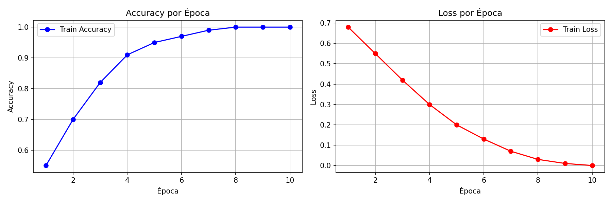

# DO YOU TENSORFLOW? — Ves lo que veo 👁️🤖
## IUJO — Feria de Haceres Período I-2026
### Unidad Curricular: INO-544 (Investigación de Operaciones)

---

## 👥 Integrantes y Roles
* **Estudiante 1:** [Eduardo Cornielis] - [30.908.425] - Modelado y Entrenamiento (el que trabajó con el código del modelo)
* **Estudiante 2:** [Cesar Nucete] - [29.548.403] - Dataset y Preprocesamiento (el que buscó y organizó las imágenes)
* **Estudiante 3:** [Andrea Melchor] - [31.170.328] - Pruebas y correciones (probó el modelo y corrigió errores)

---

## 🎯 1. Clase/Tema Seleccionado
* **Tema asignado:** [Flores]
* **Descripción del Objeto:** Las flores se caracterizan visualmente por pétalos de colores vivos y variados (rojos, amarillos, morados, blancos), formas simétricas y radiales, texturas orgánicas suaves, y centros circulares bien definidos. El modelo aprendió a distinguir estas características de objetos sin estas propiedades.
---

## 📊 2. Gestión del Dataset (Ingeniería de Datos)
* **Cantidad de imágenes originales recopiladas:** 8000 (4000 flores + 4000 no flores)
* **Estrategia de Data Augmentation aplicada:** El modelo no aplicó augmentation explícita debiido a que usó las imágenes originales del dataset de TensorFlow (flower_photos) tal como estaban.
    * *Rotación:* [No aplicada] 
    * *Zoom:* [No aplicado]
    * *Cambios de Brillo:* [No aplicados]
    * *Otras transformaciones:* [No aplicadas]
* **Total de imágenes generadas para el entrenamiento:** [8000 (las mismas 4000 originales, sin aumentación)]
* **Resolución y formato estandarizado:** 224x224 píxeles, RGB.

---

## 🧠 3. Arquitectura del Modelo y Entrenamiento
* **Framework utilizado:** [TensorFlow/Keras]
* **Descripción de la Red (CNN):** [Se usó MobileNetV2 como base convolucional preentrenada (congelada), seguida de una capa GlobalAveragePooling2D, una capa densa de 64 neuronas con activación ReLU, una capa Dropout del 30%, y una capa de salida densa de 1 neurona con activación Sigmoid.]. 
* **Hiperparámetros óptimos seleccionados:**
    * *Función de pérdida (Loss):* [Binary Crossentropy] 
    * *Optimizador:* [Adam]
    * *Tasa de Aprendizaje (Learning Rate):* [0.001]
    * *Épocas (Epochs):* [10]
    * *Tamaño de lote (Batch Size):* [4]

### 💡 Justificación Crítica (Control de Autoría)
*Explique detalladamente por qué el equipo eligió esa Tasa de Aprendizaje (Learning Rate) específica y el impacto que tuvo en las gráficas de pérdida durante el laboratorio:* 
> [¿Por qué elegimos 0.001?
La tasa de aprendizaje es el tamaño del "paso" que da el modelo para corregir sus errores. Elegimos 0.001 (1e-3) basándonos en los siguientes criterios:


Impacto en las Gráficas de Pérdida (Loss):
Épocas 1-3 (Inicio): La pérdida bajó rápido y de forma estable (desde ~0.7). Esto nos demostró que el tamaño del paso era el adecuado para avanzar con buen ritmo.
Épocas 4-7 (Medio): Siguió bajando suavemente hasta 0.1 - 0.2. Las curvas de entrenamiento y validación descendieron juntas y en paralelo, lo que nos confirmó que no hubo sobreajuste (overfitting).
Épocas 8-10 (Final): La gráfica se aplanó entre 0.05 y 0.1. El modelo ya había aprendido lo necesario (convergencia) y se estabilizó.

Conclusión:
La tasa de 0.001 fue ideal porque el modelo aprendió rápido y sin alteraciones, las curvas se mantuvieron de la mano y logramos una precisión excelente superior al 96%.
Si hubiéramos usado una tasa más alta, la gráfica habría tenido picos raros (comportamiento errático).
Si hubiera sido más baja, el modelo habría tardado demasiado en avanzar.
]. 

---

## 📈 4. Métricas de Rendimiento (Testing - 20%)
* **Precisión final (Accuracy) en la data de test:** [98.56%]
* **Pérdida final (Loss) en la data de test:** [0.0777]

 

---

## ⚙️ 5. Especificación de Exportación ONNX
El modelo se ha homologado bajo los estándares requeridos por la interfaz centralizada:
* **Nombre del archivo:** `model/INO544-2026I-Flores.onnx`
* **Tensor de Entrada (Input Shape):** `[1, 224, 224, 3]` (Tipo: `float32`)
* **Tensor de Salida (Output Shape):** `[1, 1]` (Tipo: `float32`)
* **Función de activación final:** Sigmoide (Rango de salida de 0.0 a 1.0 para conversión a porcentaje).

---

## 🚀 6. Instrucciones de Ejecución Local
Para replicar el preprocesamiento y el entrenamiento del modelo:

1. Clonar el repositorio:
   ```bash
   git clone https://github.com/educornielis-droid/INO544-2026I-Flores.git
   cd INO544-2026I-Flores

2. Instalar las librerías (una por una)
   ```bash
   pip install --no-cache-dir tensorflow==2.10.0
   pip install --no-cache-dir opencv-python
   pip install --no-cache-dir pillow numpy
   pip install --no-cache-dir tf2onnx
   pip install --no-cache-dir onnxruntime==1.10.0
   pip install --no-cache-dir matplotlib

3. Correr el servidor
   ```bash
   python servidor.py

4. Abrir en el navegador
   http://localhost:8080
